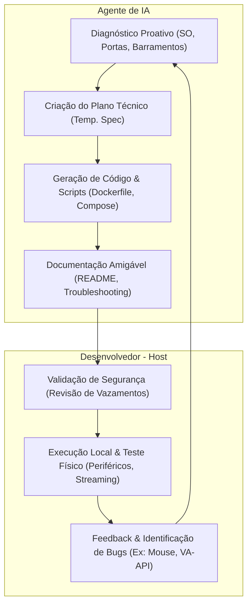

# 🧠 Especificação de Fluxo de Trabalho de IA Colaborativa (v2.0)
> **Padrão de Projeto "Abraçar e Verificar" (Embrace & Verify)** — Guia de Integração Homem-Máquina para Desenvolvimento de Infraestrutura e Sistemas Conteinerizados.

Este documento formaliza as melhores práticas de cooperação entre um Desenvolvedor (Human-in-the-Loop) e um Agente de IA de Codificação. O objetivo é reduzir a carga cognitiva do desenvolvedor através de proatividade técnica e verificação de segurança, mantendo o humano no controle das validações cruciais.

---

## 🗺️ Fluxo de Cooperação "Abraçar e Verificar"

O diagrama abaixo ilustra o loop de feedback contínuo estabelecido durante a criação e manutenção do projeto:

---

## ⚡ Pilares do Padrão de Projeto

| Pilar | Ação da IA | Papel do Humano | Benefício |
| :--- | :--- | :--- | :--- |
| **Acolhimento Inicial** | Pesquisa proativamente os barramentos de hardware e dependências antes de codificar. | Fornece detalhes de contexto ou objetivos do projeto. | Redução de erros de deploy logo na primeira execução. |
| **Higiene de Segurança** | Mantém tokens, chaves SSH/GPG e dados privados locais fora do Git com `.gitignore` preventivos. | Valida se há informações privadas expostas antes de publicar. | Proteção contra vazamento de credenciais em repositórios públicos. |
| **Automação Auxiliar** | Cria scripts interativos em segundo plano para tarefas complexas (como login OAuth na PSN). | Copia e cola os links e tokens retornados na tela do terminal. | Facilidade na execução de tarefas interativas que a IA não pode automatizar. |
| **Integração Visual** | Documenta com Mermaid, tabelas de recursos e alertas premium para facilitar a leitura. | Lê a documentação e executa comandos sugeridos. | Hand-off fluido e intuitivo para futuros desenvolvedores. |

---

## 🛠️ Fases de Desenvolvimento

### Fase 1: Diagnóstico de Hardware e Ambiente
A IA deve mapear o sistema host para identificar possíveis conflitos com antecedência.
*   **Ações:**
    1. Identificar a distribuição Linux (`Ubuntu 26.04 LTS`).
    2. Verificar a existência e permissões do grupo `input` (GID do host para periféricos).
    3. Validar a presença de drivers e nós de renderização gráfica (`/dev/dri`).

### Fase 2: Configuração e Passagem de Periféricos (Cgroups)
A IA propõe barramentos que garantem que dispositivos físicos (como o controle DualSense) funcionem dentro do container sem restrições de segurança excessivas.
*   **Ações:**
    1. Usar `privileged: true` para contornar o bloqueio de nós dinâmicos `/dev/hidraw*`.
    2. Montar `/dev:/dev` para que novos dispositivos conectados USB/Bluetooth apareçam no container.

### Fase 3: Validação de Segurança e Higiene
Antes de empurrar o projeto para a nuvem, a IA realiza buscas locais para garantir que nenhum dado sensível foi vazado.
*   **Ações:**
    1. Executar buscas por palavras-chave sensíveis (como IDs de contas).
    2. Garantir que a pasta `./data/` de persistência está listada no `.gitignore`.

---

## 💾 Lições Aprendidas de Infraestrutura (Docker & Multimídia)

Durante as iterações de depuração e ajuste no projeto AstroPod-Chiaki, consolidamos os seguintes aprendizados:

### 1. SDL2 e udev em Containers
*   **Problema:** Bibliotecas multimídia modernas (como SDL2) dependem do daemon `udev` para listar joysticks no Linux. Containers Docker não rodam o daemon `udevd`, fazendo com que o SDL2 ignore completamente qualquer controle conectado.
*   **Solução:** Definir a variável de ambiente `SDL_JOYSTICK_DISABLE_UDEV=1` no container. Isso força o SDL2 a ler diretamente a pasta `/dev/input` usando buscas manuais de arquivos de eventos (fallback estável).

### 2. Comportamento do Touchpad como Mouse (DualSense)
*   **Problema:** O touchpad do DualSense é reconhecido por padrão pelo sistema operacional do host (como o GNOME) como um dispositivo de mouse virtual. Ao ser usado no container, cliques e movimentos no touchpad podem disparar funções da interface de exibição do host (como maximizar a janela de exibição com cliques duplos) em vez de passarem para o jogo.
*   **Solução:** O desenvolvedor precisa instalar o pacote `steam-devices` no host para carregar as regras Udev corretas e, na interface gráfica do cliente Chiaki, ir até as configurações e selecionar explicitamente o controlador físico no menu suspenso para que os inputs sejam traduzidos como botões do controle.

### 3. Aceleração de Hardware (VA-API vs. Software Decode)
*   **Problema:** A aceleração gráfica `vaapi` necessita que os drivers user-space específicos da GPU do computador host (Mesa, drivers Intel Media, etc.) estejam instalados **dentro** da imagem do container. Se a imagem do Docker for minimalista, habilitar `vaapi` quebrará o renderizador gráfico com o erro `Failed to create hwdevice context`.
*   **Solução:** Manter o método de decodificação de vídeo do Chiaki como `none` (decodificação de software por CPU). Processadores modernos Intel e AMD decodificam fluxos de 1080p a 60fps sem esforço e com altíssima estabilidade, eliminando a dependência de drivers internos.

### 4. Persistência de Pareamento entre Inicializações
*   **Problema:** Em containers normais, parar ou reiniciar a máquina apagaria todas as credenciais de vínculo do PlayStation, exigindo que o usuário gere um novo PIN na TV a cada execução.
*   **Solução:** Montar o diretório de dados local no container `./data:/home/chiaki`. O banco de dados de chaves de criptografia e pareamento fica protegido no host, tornando o container descartável. Reiniciar ou reconstruir a imagem permite reconectar ao PS5 com apenas dois cliques no aplicativo.

### 5. Formatação do Mermaid Parser em Markdown
*   **Problema:** Ao descrever caminhos de arquivos Linux (ex: `/run/user/...` ou `/dev/dri`) dentro de colchetes no Mermaid (ex: `PW[/run/user/1000]`), o parser de diagramas pode confundir a barra `/` com delimitadores de desenho de formato de nós (como o paralelograma `[/ /]`). Isso gera erros léxicos e impede a renderização de diagramas no GitHub.
*   **Solução:** Sempre envolver textos que contenham barras inclinadas, espaços ou caracteres especiais em aspas duplas: `PW["/run/user/1000/pulse/native"]`.

---

## 🎯 Diretrizes para Desenvolvimento com IAs no Futuro
Para manter este nível de excelência, qualquer IA que trabalhar neste repositório deve seguir as regras:
1.  **Garantir commit assinado:** Commits locais devem sempre respeitar a assinatura digital GPG configurada na máquina.
2.  **Manter isolamento de ambiente:** Nunca use caminhos de usuário hardcoded (`/home/nauakavlis/...`) em arquivos de configuração que serão enviados ao GitHub; utilize variáveis de ambiente locais do Docker Compose.
3.  **Prover scripts prontos para uso:** Qualquer processo interativo ou complexo deve ser empacotado em scripts executáveis (`chmod +x`), minimizando o trabalho manual do desenvolvedor.
