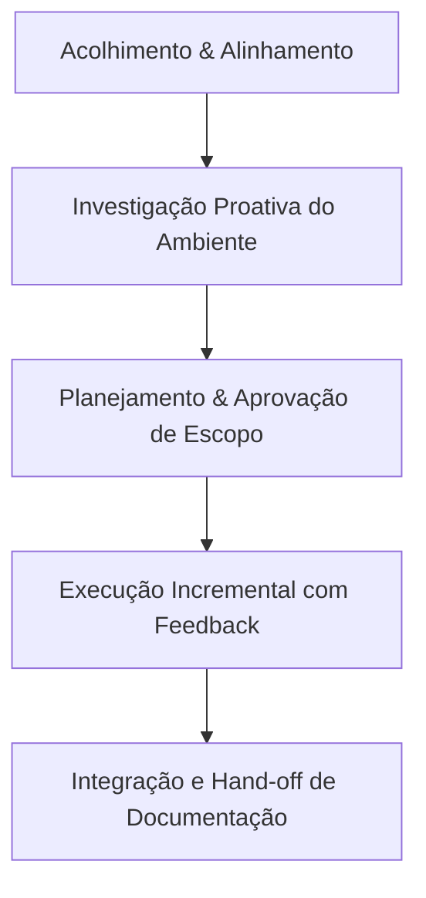

# Especificação de Fluxo de Trabalho de IA Colaborativa: "Abraçar e Verificar" (Embrace & Verify)

Este documento especifica o padrão de projeto de interação entre um Agente de IA de Codificação e um Desenvolvedor/Usuário. O objetivo é demonstrar como estruturar a cooperação para que a IA assuma a carga cognitiva técnica (pesquisa, infraestrutura, automação de scripts) e guie o usuário de forma proativa, enquanto o usuário atua como o validador final de cada etapa ("Human-in-the-Loop").

---

## 1. Princípios Fundamentais

### 1.1 Redução da Carga Cognitiva (O "Abraço")
*   **Proatividade:** A IA não deve apenas responder perguntas secas, mas prever as necessidades do fluxo (ex: ao criar um container GUI, configurar áudio, aceleração gráfica e inputs de controle antes mesmo de o usuário solicitar).
*   **Decisões Curadas:** Em vez de fazer perguntas abertas ("como você quer o nome?"), a IA deve pesquisar o contexto e apresentar opções refinadas com justificativas claras.

### 1.2 Segurança e Verificação Incremental
*   **Varredura Prévia:** Investigar permissões e chaves de segurança (SSH, GPG, ACLs de arquivos) usando comandos não intrusivos antes de propor alterações.
*   **Segurança por Padrão:** Evitar permissões amplas (ex: criar `.gitignore` para evitar vazamento de credenciais locais de Remote Play e chaves privadas).

---

## 2. Fases do Fluxo de Trabalho (Spec)

### Fase 1: Diagnóstico de Ambiente
O agente de IA mapeia as características do sistema operacional do host e o estado de configurações cruciais.
*   **Ações da IA:**
    1. Identificar versão do SO (`Ubuntu 26.04 LTS`).
    2. Verificar ferramentas instaladas (`docker`, `docker compose`).
    3. Analisar permissões de hardware (`getfacl /dev/dri/renderD128`) e grupos de usuário (`getent group input`).
*   **Resultado esperado:** Confirmação da compatibilidade do ambiente do host com o container antes da escrita de qualquer código.

### Fase 2: Planejamento & Consentimento
Modelar a solução técnica em um arquivo de plano temporário (`implementation_plan.md`) para alinhamento.
*   **Critério de Entrada:** Entendimento claro dos requisitos de hardware, rede e credenciais.
*   **Ações da IA:** Propor uma arquitetura (ex: explicar por que `network_mode: host` é necessário e seguro neste contexto de rede local).
*   **Critério de Saída:** Aprovação explícita do usuário.

### Fase 3: Execução e Automação Interativa
Codificar as configurações e automatizar tarefas complexas ou interativas.
*   **O Desafio de Inputs Interativos (OAuth):** Quando tarefas exigem logins que a IA não pode fazer (ex: autenticação na PlayStation Network), a IA executa o processo em segundo plano de forma assíncrona, expõe a URL para o usuário logar no navegador, espera a resposta e injeta o input (`stdin`) de volta para concluir a tarefa.
*   **Ações da IA:**
    1. Escrever `Dockerfile` multi-stage (isolamento de compilação).
    2. Escrever `docker_compose.yaml` (montando os barramentos de áudio, vídeo e input corretos).
    3. Rodar e gerenciar scripts auxiliares de forma interativa.

### Fase 4: Hand-off & Documentação
Entregar um ambiente pronto para produção acompanhado de documentação clara de operação.
*   **Ações da IA:**
    1. Criar um `README.md` detalhado com a arquitetura descrita e guia de solução de problemas.
    2. Fornecer comandos exatos de Git para sincronização rápida de repositórios remotos.
    3. Criar o `walkthrough.md` sumarizando as ações executadas e resultados de testes de integração.

---

## 3. Diretrizes para Programadores de IA (System Prompt Design)

Para reproduzir este comportamento, o prompt de sistema de uma IA de codificação deve incluir as seguintes instruções comportamentais:
1.  **Não presuma, verifique:** Sempre consulte as permissões de arquivos, chaves de autenticação de SSH e GPG e versões de SO antes de dar diagnósticos sobre falhas de deploy.
2.  **Mantenha a segurança e higiene:** Arquivos contendo configurações voláteis ou segredos locais (como a pasta `./data` ou chaves de pareamento de console) devem ser ignorados preventivamente via `.gitignore`.
3.  **Facilite a verificação:** Sempre apresente os resultados das validações na linguagem do usuário, de forma mastigada e formatada em tabelas ou blocos claros.
4.  **Crie documentação local integrada:** O repositório deve terminar sempre auto-explicativo para humanos, com scripts executáveis (`chmod +x`) e guias passo a passo.

---

## 4. Lições Aprendidas de Infraestrutura (Docker & Multimídia)

Durante a resolução de bugs de transmissão de controle e vídeo, os seguintes aprendizados foram consolidados para futuros builds de sistemas conteinerizados:

### 4.1 Segurança de Dispositivos e Cgroups (Bypass de Whitelist)
*   **O Problema:** Mesmo que a pasta `/dev/input` esteja mapeada e o usuário do container pertença ao grupo correto (`input` / `994`), o subsistema de segurança do Docker (cgroups device whitelist) impede a leitura/escrita direta de nós de caracteres criados dinamicamente (como `/dev/hidraw*` para gamepads DualSense). O resultado é um erro de `Permission Denied` silencioso na abertura do dispositivo pelo software (ex: SDL2).
*   **A Solução:** Usar `privileged: true` no `docker_compose.yaml` para liberar o bypass de cgroups, permitindo que a autenticação de controle de acesso (UID e ACLs) seja delegada diretamente para o kernel do host de forma correta e dinâmica.

### 4.2 SDL2 e udev em Containers
*   **O Problema:** Frameworks modernos de controle (como SDL2) dependem do daemon `udevd` para monitorar a conexão e desconexão de joysticks na rede netlink do Linux. Como esse daemon não roda por padrão dentro do container, o SDL2 assume que existem "zero controles conectados", ignorando os botões físicos.
*   **A Solução:** Injetar a variável de ambiente **`SDL_JOYSTICK_DISABLE_UDEV=1`** no container. Isso força o SDL2 a desativar a busca por eventos do udev e fazer uma varredura manual direta (fallback) nos arquivos do diretório `/dev/input`, reconhecendo os controles imediatamente.

### 4.3 Drivers de Decodificação de Vídeo (Hardware vs. Software)
*   **O Problema:** A aceleração gráfica por hardware (como `vaapi` no Linux) requer drivers de renderização específicos do fabricante (Mesa, Intel Media Driver) rodando **dentro do ambiente do container** (não apenas no host). Se o container runner for muito enxuto e faltarem os drivers, o renderizador gráfico falhará ao criar o contexto com o erro `Failed to create hwdevice context`.
*   **A Solução:** Garantir a instalação dos drivers apropriados na imagem final ou prover e documentar uma opção de decodificação por software (via CPU, configurada como `none` no Chiaki) que sirva de fallback robusto e imediato.

